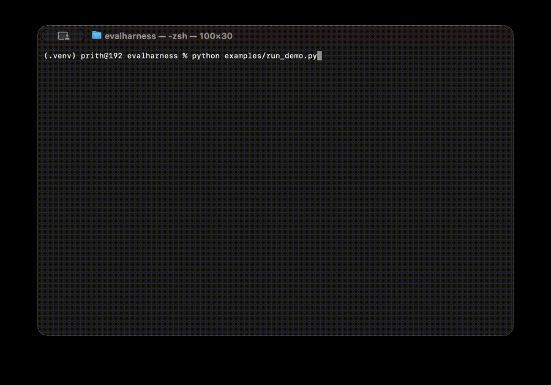

<div align="center">

# evalharness

**An agentic evaluation harness for Retrieval-Augmented Generation pipelines.**

`evalharness` exposes a Model Context Protocol (MCP) server that allows an LLM agent to autonomously evaluate any RAG pipeline — fetching test questions, executing the pipeline, scoring outputs with an LLM-as-judge, and persisting results — through a single natural-language instruction.

[](https://www.python.org/downloads/)
[](LICENSE)
[](https://modelcontextprotocol.io)

</div>



---

## Overview

Evaluating RAG pipelines is one of the most consequential and most overlooked stages of shipping a GenAI system. Conventional evaluation workflows rely on engineers manually executing pipelines against test sets, scoring outputs by hand, and reconciling results across spreadsheets and documents. These workflows are slow, inconsistent, and difficult to reproduce.

`evalharness` reframes evaluation as an agentic workflow. The harness is exposed as an MCP server with four orchestration tools, which any MCP-compatible client (Claude Desktop, Cursor, custom agents) can invoke. The agent decides when and how to run an evaluation; the harness handles question retrieval, pipeline execution, ground-truth isolation, and LLM-as-judge scoring.

## Key features

- **MCP-native interface.** Four orchestration tools exposed over the Model Context Protocol, enabling end-to-end evaluation from a single agent instruction.
- **Ground-truth isolation.** Expected answers are projected at the database layer and never exposed to the answering pipeline, preventing inadvertent leakage.
- **Pluggable judges.** Built-in support for OpenAI, Google Gemini, and Anthropic Claude as evaluator models. Adding a new provider requires a single subclass.
- **Configurable metrics.** Four built-in metrics (faithfulness, answer relevance, hallucination, correctness) with a straightforward interface for adding custom ones.
- **Atomic run identifiers.** All persisted runs receive auto-incremented, conflict-free IDs, supporting concurrent evaluation workloads.
- **Local-first persistence.** SQLite by default, with a clean storage interface for swapping in alternative backends.

## Architecture

```
┌─────────────────┐      ┌──────────────────────┐      ┌─────────────────┐
│  MCP Client     │      │  evalharness server  │      │  Your RAG       │
│  (Claude, etc.) │─────▶│  (FastMCP)           │─────▶│  pipeline       │
└─────────────────┘      └──────────┬───────────┘      └─────────────────┘
                                    │
                  ┌─────────────────┼─────────────────┐
                  ▼                 ▼                 ▼
            ┌──────────┐     ┌──────────┐      ┌──────────┐
            │ Storage  │     │ Judges   │      │ Metrics  │
            │ (SQLite) │     │ OAI/Gem  │      │ faith /  │
            │          │     │ Claude   │      │ rel /    │
            └──────────┘     └──────────┘      │ halluc   │
                                               └──────────┘
```

### Tools exposed by the MCP server

| Tool              | Description                                                                              |
| ----------------- | ---------------------------------------------------------------------------------------- |
| `fetch_questions` | Retrieve a test question set by name. Ground truth is not exposed to the calling agent.  |
| `run_pipeline`    | Execute a registered RAG pipeline against every question in a set; persist all outputs.  |
| `score_run`       | Score a completed run using an LLM-as-judge across one or more configurable metrics.     |
| `list_available`  | Return the registered pipelines, judges, and metrics available on the running server.    |

## Installation

```bash
pip install evalharness
```

To install from source:

```bash
git clone https://github.com/20pritha/evalharness.git
cd evalharness
pip install -e .
```

Provider-specific dependencies are optional and installed via extras:

```bash
pip install "evalharness[openai]"      # OpenAI judge
pip install "evalharness[gemini]"      # Google Gemini judge
pip install "evalharness[anthropic]"   # Anthropic Claude judge
pip install "evalharness[all]"         # All providers
```

## Quickstart

### 1. Register your RAG pipeline

```python
from evalharness import register_pipeline

@register_pipeline("my_rag")
def my_rag(question: str) -> dict:
    # Replace with your retrieval and generation logic.
    return {
        "answer": "The capital of France is Paris.",
        "context": ["France's capital city is Paris."],
    }
```

### 2. Load a test set

```bash
evalharness load-questions examples/sample_questions.jsonl --name demo_set
```

Each line of the JSONL file should be a JSON object of the form:

```json
{"question": "...", "expected_answer": "...", "metadata": {}}
```

### 3. Start the MCP server

```bash
evalharness serve
```

### 4. Connect from an MCP-compatible client

Example configuration for Claude Desktop (`claude_desktop_config.json`):

```json
{
  "mcpServers": {
    "evalharness": {
      "command": "evalharness",
      "args": ["serve"]
    }
  }
}
```

### 5. Invoke the harness from the agent

A single natural-language instruction is sufficient:

> Run an evaluation on the `demo_set` test set against the `my_rag` pipeline using Gemini as the judge.

The agent will sequentially call `fetch_questions`, `run_pipeline`, and `score_run`, returning a summary of aggregated metric scores.

## Supported judges

| Provider          | Status     | Installation extra |
| ----------------- | ---------- | ------------------ |
| OpenAI            | Supported  | `[openai]`         |
| Google Gemini     | Supported  | `[gemini]`         |
| Anthropic Claude  | Supported  | `[anthropic]`      |
| Ollama (local)    | Planned    | —                  |

## Built-in metrics

| Metric              | Description                                                                       |
| ------------------- | --------------------------------------------------------------------------------- |
| **Faithfulness**    | Degree to which the answer is grounded in the retrieved context.                  |
| **Answer Relevance**| Degree to which the answer addresses the question posed.                          |
| **Hallucination**   | Proportion of claims in the answer not supported by the retrieved context.        |
| **Correctness**     | Semantic agreement between the answer and a provided ground-truth answer.         |

Custom metrics are supported by subclassing `BaseMetric` and registering the class with the `@register_metric` decorator.

## Design rationale

### Why MCP

Traditional evaluation tools require engineers to write driver scripts, manage state across CLI invocations, and manually trigger each phase of the workflow. Exposing the harness as an MCP server inverts this model: the agent orchestrates the workflow, and the harness provides the primitives. This allows evaluation runs to be initiated from any MCP-compatible interface, integrated into broader agentic workflows, and triggered conversationally rather than scripted procedurally.

### Why ground-truth isolation

If a RAG pipeline can observe expected answers during execution — through database queries, logs, or retrieval contamination — evaluation results are no longer meaningful. `evalharness` enforces isolation at the storage layer: the agent-facing fetch returns only questions, while the judge-facing fetch returns the full record. This guarantee holds regardless of how the pipeline is implemented.

## Roadmap

- Ollama and local-model judge support
- HTML report generation for completed runs
- Exporters for Weights & Biases and MLflow
- Parallel judge dispatch via `asyncio`
- Streaming progress updates to the MCP client

## Contributing

Contributions are welcome. Please open an issue to discuss substantial changes before submitting a pull request. All contributions must include tests and pass the existing test suite (`pytest`).

## License

Released under the MIT License. See [LICENSE](LICENSE) for the full text.

---

<sub>Maintained by [Pritha Mishra](https://github.com/20pritha).</sub>
